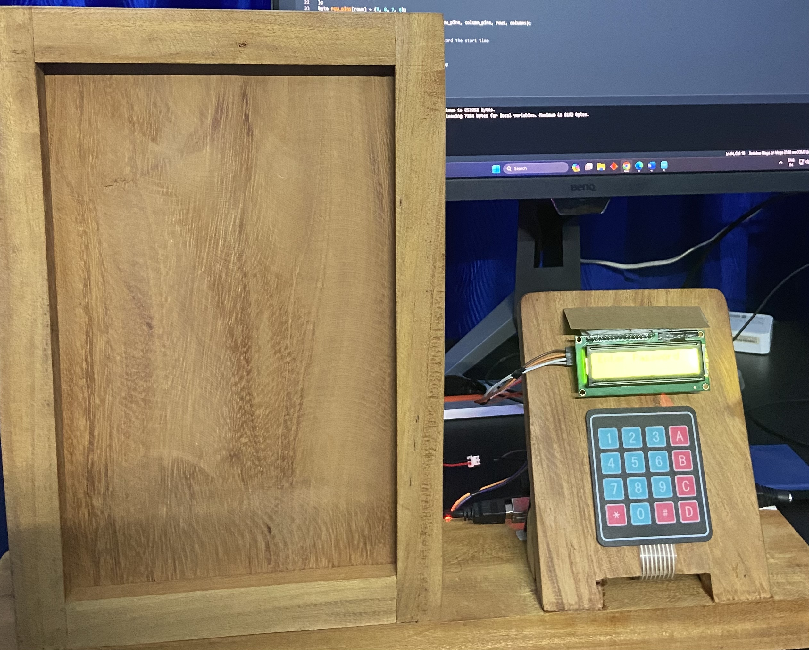
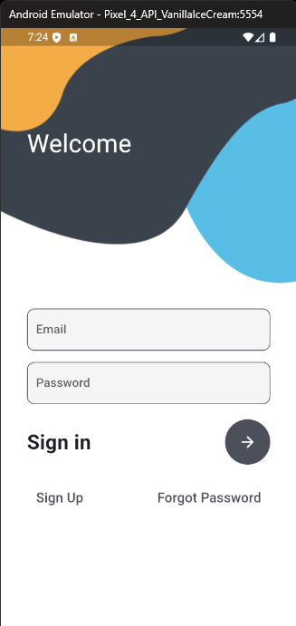
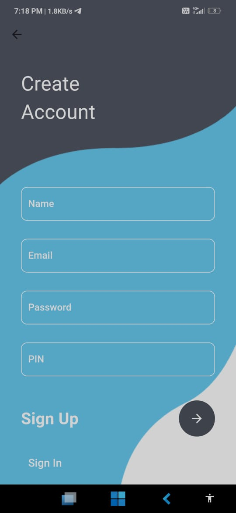
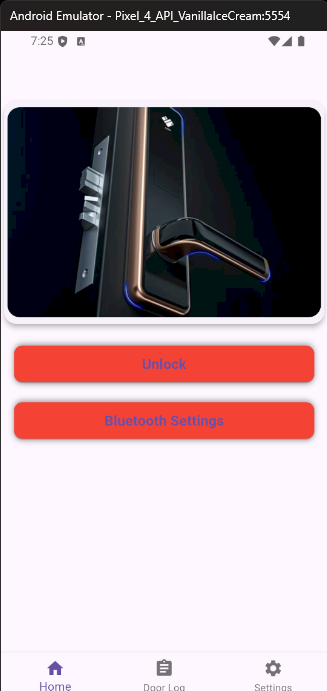
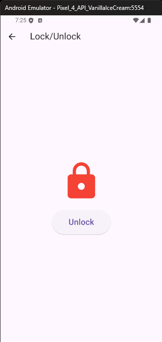
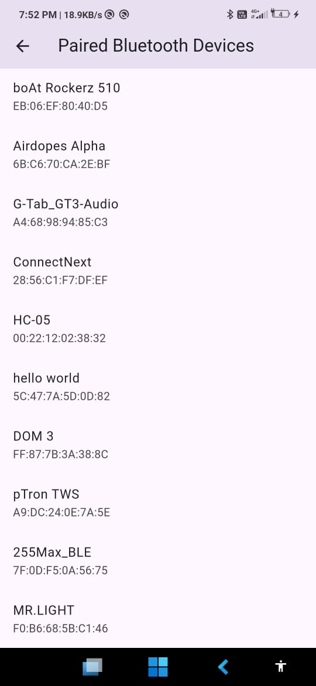

# Smart Door Lock Application
## 🎥 [Click here for demo video](https://drive.google.com/drive/folders/1EyRwp7L2ESP2sx44u6QuYgn9d9g-N-rZ?usp=sharing "🔼 Google Drive ") 🎥
## Overview
The **Smart Door Lock Application** allows users to control a door lock mechanism using an **Arduino Mega** and a **Bluetooth HC-05 module**. The app provides functionalities to lock or unlock the door through Bluetooth communication, with user authentication powered by Firebase.

## Features
- **Bluetooth Connectivity**: Communicate with the door lock system via Bluetooth (HC-05).
- **User Authentication**: Firebase-based login, signup, and forgot password functionality.
- **Unlock/Lock Functionality**: A button within the app that allows users to lock or unlock the door.
- **User-Friendly Interface**: Multiple pages such as login, signup, home page, lock page, and Bluetooth connectivity page.

## Application Pages

### 1. **Login Page**:
   - Users can log in using their credentials (email and password).
   - Includes functionality for forgotten passwords via Firebase.
   - The page design includes fields for email, password, and a button to submit the information.

   

### 2. **Signup Page**:
   - Allows new users to register with their email, password, and confirm the password fields.
   - User data is stored securely in Firebase.

   

### 3. **Home Page**:
   - After successful login, users are directed to the home page.
   - This page gives an overview of the current status of the door lock (locked or unlocked).
   - Provides access to Bluetooth connectivity settings.

   

### 4. **Lock Control Page**:
   - Provides buttons to lock and unlock the door. 
   - The status of the lock is updated in real-time based on the user's actions.
   - The Bluetooth module connects to the Arduino Mega, sending signals to control the door lock mechanism.

   

### 5. **Bluetooth Connectivity Page**:
   - Allows users to pair their phone with the HC-05 Bluetooth module attached to the Arduino.
   - Displays the Bluetooth connection status and available devices.
   
   

